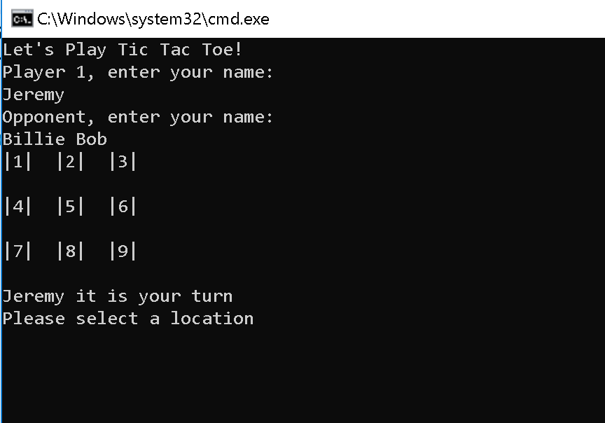
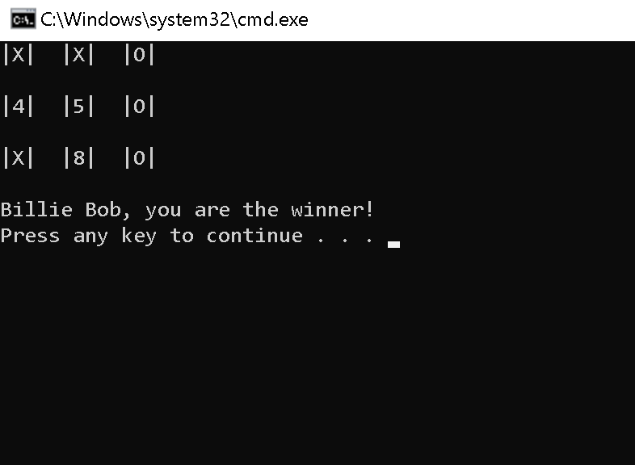

## Tic-Tac-Toe

Create a Tic-Tac-Toe console application that displays an updated game board while playing with 2 players. The winner or draw is returned.

# Load Application
1.	in terminal: git clone https://github.com/mtncrawler/lab04-TicTacToe
2.	open Lab04_TicTacToe.sln
3.	run project without debugging
4.	play the game!

